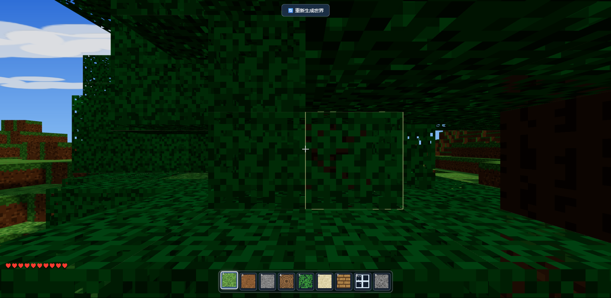

# 方块世界 v0.3 · 浏览器 3D 沙盒

用 JavaScript + Three.js 写的离线浏览器小游戏。打开后生成一张有限的方块世界，可以移动、跳跃、挖掘、放置和保存修改。




## 直接运行

### Windows

双击 `start.bat`。启动器会从 8080 开始寻找空闲端口，优先使用 Node.js 自带服务器，找不到 Node.js 时回退到 Python，然后自动打开浏览器。

### 命令行

```powershell
# 第一次运行开发测试时安装 Node 依赖
npm install
npm start
```

然后访问 `http://127.0.0.1:8080`。只运行游戏时也可以直接使用：

```powershell
node server.js 8080
# 或
python -m http.server 8080
```

浏览器运行需要本地 HTTP 服务，不要直接双击 `index.html`。Three.js 已经放在 `js/libs/`，游戏本身不需要联网下载资源。

## 当前版本

- 程序化生成 `96 × 96 × 64` 的有限世界，包含草方块、泥土、石头、沙子、木头、树叶等材质。
- 第一人称移动、跳跃、冲刺、潜行、重力和方块碰撞。
- 按住左键逐步破坏方块，右键放置方块；破坏过程会显示缓冲进度，也支持连续操作。
- 生命值、坠落伤害、重生、无敌模式和浏览器 `localStorage` 存档。
- 所有材质由代码运行时绘制，不依赖外部图片素材。

## 操作

| 操作 | 按键 |
| --- | --- |
| 移动 | `W` `A` `S` `D` 或方向键 |
| 跳跃 | 空格 |
| 潜行 | `Shift` |
| 冲刺 | 快速双击 `W` |
| 破坏方块 | 按住鼠标左键 |
| 放置方块 | 鼠标右键 |
| 切换方块 | 数字键 `1`–`9` |
| 无敌模式 | `I` |
| 视角灵敏度 | `-` / `=` |
| 重新生成世界 | `R`，需要二次确认 |
| 释放鼠标 | `Esc` |
| 帮助 / 调试信息 | `H` / `F3` |

点击“开始游戏”后会进入鼠标锁定模式；如果浏览器拒绝锁定，可以使用“拖动视角模式”。

## 开发测试

```powershell
npm install
npm test
npm run test:stress
```

浏览器自测地址：`http://127.0.0.1:8080/index.html?selftest`。

## 文件结构

```text
index.html              页面入口和 HUD
server.js               Node 静态服务器与测试报告接口
start.bat               Windows 双击启动入口
start-server.ps1        自动选端口、启动服务并打开浏览器
js/main.js              渲染、交互和主循环
js/world.js             世界生成、修改和存档
js/mesher.js            方块网格合并与面剔除
js/player.js            重力、跳跃和碰撞
js/breaking.js          破坏时长与目标辅助逻辑
js/ui.js                HUD、提示和状态反馈
tools/                  Node 自测与压力测试
docs/                   项目截图
```

## 当前限制

世界是单机本地的有限地图，目前没有水体、生物或昼夜循环。项目重点是把方块世界的生成、交互、碰撞和存档流程做成一个可以直接打开试玩的小样例。

初版用于测试 AI 编程能力，后续根据实际运行反馈做了少量修订。

## License

MIT License
