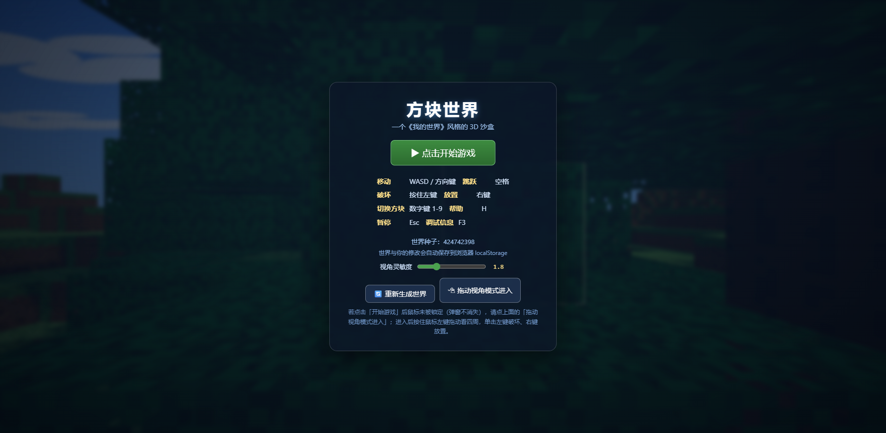

# 方块世界 · 3D 沙盒小游戏（《我的世界》风格）

一个用 **JavaScript + Three.js** 从零实现的、可在电脑浏览器里运行的 3D 沙盒小游戏：随机地形、第一人称、破坏/放置方块、生命与坠落伤害、存档、完整画面氛围。



这是一次 AI 编程能力测试小实验：初版由 DeepSeek Finance 根据简短需求生成，后续经过人工体验反馈与 Codex 协助精修、验证。它不是完整的 Minecraft 复刻，也不使用 Minecraft 原版素材。

> 开源仓库：<https://github.com/Henry369-0/minecraft-3d-sandbox> （MIT License）

---

## 🚀 启动方法

### 方法一（推荐）：双击 `start.bat`
自动完成：寻找可用端口（8080 起）→ 优先用 Python（自动跳过微软商店占位程序），否则用 Node.js 启动本地服务器 → **自动打开浏览器**。

### 方法二：命令行
```bash
# Node.js（推荐）
npm install
npm start

# 或使用任意静态服务器（游戏本体无需安装依赖）
python -m http.server 8080
```
然后访问 `http://127.0.0.1:8080`。

> 注意：由于使用了 ES Module，请务必通过本地服务器访问（`http://127.0.0.1`），**不要**直接双击 `index.html`（浏览器会因 CORS 禁止加载模块）。

### 环境要求
- 任意现代浏览器（Chrome / Edge / Firefox），需要支持 WebGL
- 无需安装任何依赖，Three.js 已打包在 `js/libs/` 中，离线可玩

---

## 🎮 操作说明

| 操作 | 按键 |
| --- | --- |
| 移动 | `W` `A` `S` `D`（或方向键） |
| 跳跃 | `空格` |
| 潜行（慢走） | `Shift` |
| 冲刺 | 快速双击 `W` 并按住 |
| 破坏方块 | 按住鼠标**左键**（带进度缓冲，可连续破坏） |
| 放置方块 | 鼠标**右键**（可长按连续放置） |
| 切换方块 | 数字键 `1` – `9` |
| 无敌模式开关 | `I` |
| 视角灵敏度 | `-` 降低 / `=` 提高（Shift 微调；开始界面的滑块也可调） |
| 重新生成世界 | `R` 键或顶部按钮（需二次确认，防误触） |
| 释放/锁定鼠标 | `Esc` / 点击画面 |
| 帮助 / 调试信息 | `H` / `F3` |

点击「▶ 点击开始游戏」进入（浏览器会锁定鼠标指针）；若鼠标锁定被浏览器拒绝，可点「拖动视角模式进入」。拖动模式中按住左键拖动视角，按住左键破坏方块。

## ❤️ 生命与坠落伤害
- 角色 20 点生命（10 颗心，屏幕左下角显示）。
- **坠落伤害**：下落超过 3.2 格后，每多 1 格扣 1 点血（如 10 格坠落扣 7 点）。
- 受伤时屏幕红闪提示；**生命归零会死亡**，3 秒后自动在出生点重生（也可按空格/回车/点击立即重生）。
- **无敌模式（按 `I`）**：开启后不掉血，左上角显示「⚡ 无敌模式」徽章，存档会记住开关状态。

## 💾 存档
- 世界（种子 + 地形修改）、玩家位置、血量、无敌开关、灵敏度、手持方块**自动保存**到浏览器 `localStorage`（键 `mc3d_save_v1`），刷新或关闭页面后自动恢复，无需手动操作。
- 页面会自动把 `localhost` 重定向到 `127.0.0.1`，保证存档域一致（两者 localStorage 不互通）。
- 「重新生成世界」使用游戏内确认框（两个明确按钮），避免误触导致进度丢失。

---

## 📁 文件结构

```
minecraft3d/
├── index.html          # 页面入口（HUD/遮罩/错误捕获/importmap）
├── css/style.css       # 全部界面样式（准星、快捷栏、遮罩、提示）
├── server.js           # 极简 Node 静态服务器（含测试报告端点）
├── start.bat           # 双击启动（调用 start-server.ps1）
├── start-server.ps1    # 启动器：自动选端口、起服务、开浏览器
├── js/
│   ├── libs/three.module.js   # Three.js 0.170 本地副本（离线可用）
│   ├── noise.js        # 可复现随机数 + 2D 值噪声 + 分形叠加（fBm）
│   ├── textures.js     # 像素风纹理：运行时 Canvas 绘制 4x4 贴图图集
│   ├── breaking.js     # 方块破坏时长与目标键辅助逻辑
│   ├── world.js        # 世界数据、确定性地形生成、树木、存档序列化
│   ├── mesher.js       # 区块网格化：面剔除 + UV + 顶点色（面部明暗）
│   ├── raycast.js      # 体素射线投射（Amanatides & Woo DDA）
│   ├── player.js       # 玩家物理：重力/跳跃/逐轴 AABB 碰撞
│   ├── ui.js           # 快捷栏、准星、提示、遮罩、统计
│   └── main.js         # 主入口：渲染/光照/阴影/天空/交互/主循环
└── tools/
    ├── download-three.js     # 重新下载 Three.js 用的小工具（可删）
    ├── selftest-node.mjs     # Node 无头逻辑自测
    └── stress-test.mjs       # 压力测试（2000 次编辑 + 30 秒物理模拟）
```

---

## 🛠 主要技术实现

### 世界生成（`world.js` + `noise.js`）
- 多层 **2D 值噪声（fBm）** 生成高度图：大陆起伏 + 细节噪声 + 偶发高原；低洼处自动生成沙滩。
- 列填充：`基岩(0) → 石头 → 泥土 → 草/沙`；草地上按固定顺序用种子随机数种树（树干 + 三层树叶，四角随机镂空）。
- **确定性**：所有随机都来自 `mulberry32(seed)`，同一种子必然生成同一世界 —— 这是存档的基础。
- 存档只记录 `seed + 修改差异列表`，恢复时重新生成地形再回放修改，体积小、速度快。

### 网格化与性能（`mesher.js` + `main.js`）
- 世界按 `16×16` 整高列分块，每块合并为**单个 BufferGeometry**，不是每方块一个 Mesh。
- **面剔除**：相邻两个不透明方块之间的面不生成；透明方块（树叶/玻璃）与空气的面照常生成，实现透视图。
- 每个顶点带 **UV（图集采样）+ 顶点色**：顶部亮、底部暗、侧面色差，配合每方块微随机亮度，还原《我的世界》的体素光照观感。
- **脏区块队列**：破坏/放置方块只标记所在区块（及边界邻居），每帧最多重建 3 个区块，避免瞬间卡顿。
- 其他优化：`pixelRatio` 上限 1.75、`NearestFilter` 像素纹理、共享材质、阴影贴图 2048、雾效遮挡远处、渐进式加载。

### 画面氛围
- 渐变天空（Canvas 背景纹理）+ 匹配地平线的**线性雾**。
- 平行光**阴影**（随玩家移动）、半球光 + 环境光补光、ACES 电影级色调映射。
- 太阳光斑 Sprite、缓缓漂移的云层。
- 像素风材质全部由代码在运行时用 Canvas 绘制（草、泥土、石头、原木年轮、树叶镂空、玻璃、圆石、木板…），无需任何外部图片。

### 玩家与交互
- 第一人称：Pointer Lock 控制视角（Yaw/Pitch），WASD 相对视角移动，空格跳跃，双击 W 冲刺（带 FOV 变化），Shift 潜行。
- 物理：重力 + 逐轴 **AABB 与体素碰撞**（X/Z/Y 分轴移动并回弹），不能穿墙、不能掉进地面；挖空脚下会真的坠落。
- 交互：DDA 体素射线拾取（射程 6 格），按住左键按方块材质逐步破坏（基岩除外）、右键在贴脸位置放置；放置位置与玩家身体相交时禁止，避免把自己卡进方块。
- 准星锁定方块会有黄色线框高亮。

### 自测（开发用）
- **Node 无头自测**（推荐，无需浏览器）：
  ```bash
  npm install
  npm test
  npm run test:stress
  ```
- 测试通过时进程退出码为 `0`，详细断言见终端输出。
- 浏览器自测：访问 `http://127.0.0.1:8080/index.html?selftest`，页面会以无 WebGL 模式运行同样的逻辑自测并把结果显示在页面上。

---

## 已知限制
- 世界大小为 `96×96×64` 的有限世界（玩家会被限制在边界内）。
- 无水源、无生物、无昼夜循环（后续可扩展）。
